# 🌙 Selene

A social nightlife discovery app that connects users to venues through their friends and social connections. Built with SwiftUI (iOS) and Bun (Backend).

<div align="center">
  
  
  
</div>

---

## 📋 Table of Contents

- [Overview](#overview)
- [Features](#features)
- [Architecture](#architecture)
- [Prerequisites](#prerequisites)
- [Setup Instructions](#setup-instructions)
- [Project Structure](#project-structure)
- [Design Decisions](#design-decisions)
- [AI Agent Integration](#ai-agent-integration)
- [Third-Party Resources](#third-party-resources)
- [Development Process](#development-process)

---

## Overview

**Selene** is a social nightlife/event app designed to solve the friction in planning nights out. Instead of just discovering venues, users see *who they know* is interested in each place—creating social proof that drives real-world meetups.

### The Core Philosophy

> When people go out, they don't just care about the venue itself—they care about WHO they know that went there.

### Goals

- **Connect** users to places (venues) and people (friends/mutuals)
- **Show** users a place, show them who else is interested, and help them book it
- **Get** people to actually go out offline

---

## Features

### 🎬 Discovery Feed

- Full-screen vertical video reels showcasing venue atmospheres
- Social proof via "Face Pile" showing friends interested
- Invited venues prioritized at the top with gold badges
- Swipe navigation between venues

### 👥 Social Integration

- See which friends are interested in each venue
- Receive and accept invitations from friends
- View mutual connections interested in venues

### 🤖 Selene AI Agent

- Smart booking assistant that analyzes social connections
- Proactive suggestions based on shared interests
- Automated reservation creation with invite sending
- Natural language reasoning: *"You and Sarah both love jazz spots—Blue Note would be perfect!"*

### 📋 Profile & Saved Places

- View saved/hearted venues in a grid layout
- Dynamic status chips showing friend interest levels
- Quick access to plan outings from saved venues

---

## Architecture


### Data Flow

```mermaid
sequenceDiagram
    participant User
    participant AgentSheet as AgentSheetView
    participant Backend as Backend API
    participant Banner as Smart Reasoning Banner
    participant Booking as Booking Service
    participant Invite as Invite Service
    participant Confirm as Confirmation View
    
    User->>AgentSheet: Tap "Let's Go"
    AgentSheet->>Backend: GET /agent/suggestion?venueId=blue-note
    Note over Backend: Analyzes:<br/>• User's hearted venues<br/>• Friends' interests<br/>• Shared venue types
    Backend-->>AgentSheet: Returns suggestion with reasoning
    AgentSheet->>Banner: Display reasoning
    Banner-->>User: "You and Sarah both love jazz spots!"
    
    User->>AgentSheet: Tap "Book & Invite"
    AgentSheet->>Booking: POST /bookings
    Booking-->>AgentSheet: Booking created
    AgentSheet->>Invite: POST /invites
    Invite-->>AgentSheet: Invites sent
    
    AgentSheet->>Confirm: Show confirmation
    Confirm-->>User: Confirmation code + invite status
```



---

## Prerequisites

### iOS Client

- **macOS** 13.0+ (Ventura or later)
- **Xcode** 15.0+
- **iOS** 17.0+ deployment target
- **Swift** 5.9+

### Backend Server

- **Bun** 1.0+ (JavaScript/TypeScript runtime)
- **Google AI API Key** (for Gemini model)

---

## Setup Instructions

### 1. Clone the Repository

```bash
git clone <repository-url>
cd selene
```

### 2. Backend Setup

```bash
# Navigate to server directory
cd server

# Install dependencies
bun install

# Create environment file
cp .env.example .env

# Edit .env with your API key
# GOOGLE_GENERATIVE_AI_API_KEY=your-api-key-here
# CURRENT_USER_ID=550e8400-e29b-41d4-a716-446655440000
# PORT=3000

# Start development server
bun run dev
```

The server will run at `http://localhost:3000`.

### 3. iOS Client Setup

```bash
# Navigate to client directory
cd client

# Open in Xcode
open client.xcodeproj
```

In Xcode:

1. Select your target device/simulator (iOS 17.0+)
2. Update the API base URL in `APIClient.swift` if needed
3. Build and run (⌘+R)

### 4. Verify Setup

```bash
# Test backend health
curl http://localhost:3000/health

# Expected response:
# {"status":"ok","timestamp":"..."}
```

---

## Project Structure

```
selene/
├── client/                          # iOS SwiftUI Application
│   └── client/
│       ├── Models/                  # Data models
│       │   ├── User.swift
│       │   ├── Venue.swift
│       │   └── Invitation.swift
│       ├── Views/                   # UI components
│       │   ├── Feed/                # Discovery feed
│       │   │   ├── FeedView.swift
│       │   │   ├── VenueReelView.swift
│       │   │   └── FacePileView.swift
│       │   ├── Detail/              # Venue details
│       │   │   └── VenueDetailView.swift
│       │   ├── Agent/               # AI booking agent
│       │   │   ├── AgentSheetView.swift
│       │   │   ├── InviteAcceptanceView.swift
│       │   │   └── BookingConfirmationView.swift
│       │   └── Profile/             # User profile
│       │       └── ProfileView.swift
│       ├── Services/                # API & state management
│       │   ├── APIClient.swift
│       │   └── AppState.swift
│       └── Theme/                   # Design system
│           ├── Colors.swift
│           └── Typography.swift
│
├── server/                          # Bun TypeScript Backend
│   ├── src/
│   │   ├── index.ts                 # Bun.serve() entry point
│   │   ├── routes/                  # API route handlers
│   │   │   ├── venues.ts
│   │   │   ├── social.ts
│   │   │   ├── invites.ts
│   │   │   ├── bookings.ts
│   │   │   └── agent.ts
│   │   ├── services/                # Business logic
│   │   │   ├── agent.ts             # Selene AI agent
│   │   │   └── feed-builder.ts      # Social enrichment
│   │   ├── db/                      # Data layer
│   │   │   ├── index.ts             # JSON utilities
│   │   │   └── data/                # JSON data files
│   │   └── types/                   # TypeScript types
│   └── package.json
│
├── attachments/                     # Reference materials
└── .cursor/plans/                   # Implementation plans
```

---

## Design Decisions

### 1. Full-Bleed Video Feed

**Decision:** Use TikTok-style vertical video reels instead of static cards.

**Rationale:**

- Creates immersive venue preview experience
- Differentiates from traditional listing apps
- Video conveys atmosphere better than photos

**Implementation:** Custom `CustomVideoPlayer` using AVPlayer with range request support for streaming.

### 2. Social Proof First

**Decision:** Display friend avatars ("Face Pile") as the primary call-to-action, not star ratings.

**Rationale:**

- Users decide based on WHO is going, not ratings
- Creates FOMO and social motivation
- Aligns with app's core value proposition

### 3. Agent Sheet vs Chat

**Decision:** Use a structured action sheet instead of freeform chat for bookings.

**Rationale:**

- Faster for simple booking flows
- Reduces cognitive load
- Still provides smart suggestions
- Chat available for complex queries

### 4. Bun Native Server

**Decision:** Use Bun's native `Bun.serve()` instead of Express/Hono.

**Rationale:**

- Zero dependencies for HTTP routing
- Better performance
- Simpler codebase
- Native TypeScript support

### 5. JSON File Storage

**Decision:** Use JSON files instead of a database.

**Rationale:**

- Demo/prototype focused
- Easy to inspect and modify data
- No database setup required
- Sufficient for 3-user demo scenario

---

## AI Agent Integration

The Selene AI Agent is powered by **Google Gemini** (via Vercel AI SDK) and provides smart booking suggestions and streaming chat **capabilities**. The agent analyzes social connections and shared interests to provide personalized recommendations.

For detailed API documentation, see [server/README.md](server/README.md#agent-selene).

### AI Usage in Development

Cursor AI (Claude) was used extensively as a coding agent throughout development:

| Area | AI Usage |
|------|----------|
| **Architecture Planning** | Generated implementation plans in `.cursor/plans/` |
| **SwiftUI Views** | Scaffolded view structures and layouts |
| **API Client** | Generated HTTP client with async/await patterns |
| **Type Definitions** | Created TypeScript and Swift type definitions |
| **Video Player** | Implemented AVPlayer integration for reel playback |
| **Bug Fixes** | Debugged video streaming and CORS issues |

---

## Third-Party Resources

### Dependencies

| Package | Version | Purpose |
|---------|---------|---------|
| **Vercel AI SDK** | ^5.0.104 | LLM streaming and tool calling |
| **@ai-sdk/google** | ^2.0.44 | Google Gemini integration |
| **zod** | ^3.25.67 | Schema validation for agent tools |

### Design Inspiration

- [Partiful iOS](https://mobbin.com/apps/partiful-ios-8d86fde9-d2bf-43ad-9a45-62818f75d1aa/) - Event invitation UX patterns
- [Luna Community](https://www.lunacommunity.net/) - Social discovery concepts

### Media Assets

- Video assets from [Pexels](https://www.pexels.com/) (free stock videos)
- Avatar images are placeholder assets for demo purposes

---

## Development Process

### Planning Phase

The development process began with hands-on design exploration:

1. **Paper Sketches** - Initial UI mockups sketched on paper to explore layout and user flows
   - Feed view with video reels and social overlays
   - Agent booking sheet interactions
   - Profile and saved places layouts

   
   

2. **Requirements Analysis** - Parsed assignment document to identify core features
3. **User Flow Mapping** - Documented discovery → validation → action flow

4. **Mock Data Strategy** - Defined personas (Alex, Sarah, Mike) and venues

### Implementation Plans

After sketching, development was guided by structured plans in `.cursor/plans/`:

| Plan | Description |
|------|-------------|
| `swiftui-ui-draft` | Complete UI wireframes and component hierarchy (digitalized from sketches) |
| `selene-backend-implementation` | API design and data layer architecture |
| `proactive-agent-suggestions` | Smart reasoning feature specification |
| `invite-acceptance-flow` | Invitation UX implementation |

### Design Process Flow

```
Paper Sketches → Digital Wireframes → Implementation Plans → Code
     ↓                ↓                      ↓              ↓
  Quick ideas    Structured plans    Technical specs   SwiftUI/TS
```

### Key Challenges & Solutions

| Challenge | Solution |
|-----------|----------|
| Video streaming on iOS | Implemented byte-range request handling on backend |
| Real-time social state | Created feed-builder service for data enrichment |
| Agent context awareness | Built context injection with venue and friend data |
| Invite flow differentiation | Created separate `InviteAcceptanceView` for acceptances |

---

## Documentation

For detailed documentation on specific components:

- **[Backend API Documentation](server/README.md)** - Complete API reference, endpoints, and server setup
- **[iOS Client Documentation](client/README.md)** - SwiftUI architecture, components, and client setup
